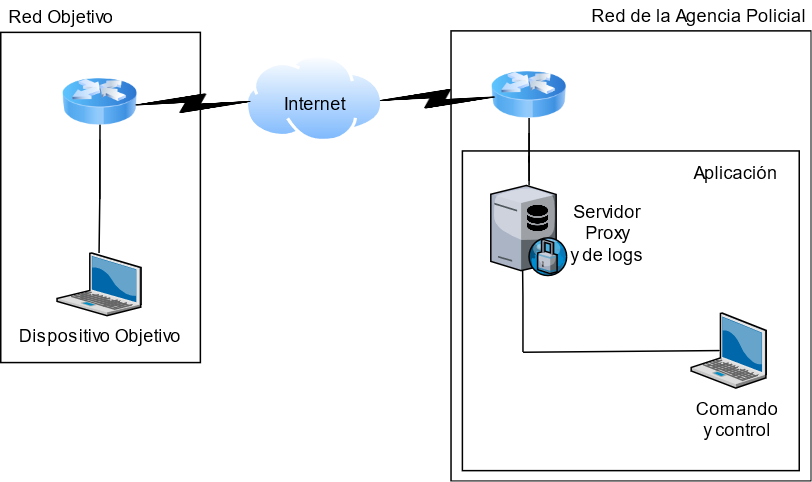
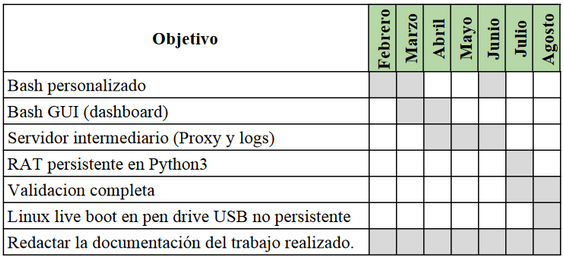

### Tema: Ciberseguridad

### Nombre: Aplicación para acción ofensiva avanzada persistente con fines legales

#### Keywords: Network Security, Information Security, Computer Security, Computer Hacking

---

**Director:** Mgtr. Ing. Miguen Ángel Solinas

**Co-director:** Esp. Ing. Javier Jorge

### Objetivo 

Diseñar e implementar una aplicación integral de lanzamiento de APTs para recopilación de evidencias en procedimientos judiciales (ciber allanamientos) a través de un entorno seguro, limitado, transparente y documentado que garantice la legitimidad del procedimiento, motivados por nuestro compromiso a la protección de los derechos fundamentales a la privacidad y velar por la seguridad del Internet.

---

### 
Aplicación para acción ofensiva avanzada persistente con fines legales

 
En septiembre de 2019, el diputado Jorge Henn presentó un <a href=https://www.lapoliticaonline.com/nota/121996-proponen-crear-un-troyano-judicial-para-implementar-cyberallanamientos-en-santa-fe/> proyecto de ley </a> para incluir la figura del allanamiento digital y modificar el Código Procesal Penal de la provincia de Santa Fe. En su explicación Henn afirmó que “La justicia no debería ser ajena a los cambios tecnológicos que se producen y que fueron complejizando los delitos. Los allanamientos con los métodos tradicionales dejaron de funcionar de la misma manera porque las pruebas, en muchos casos, pasaron a ser digitales”, y a su vez, alertó sobre la necesaria autorización judicial para “resguardar la privacidad y evitar que un mal desempeño provoque la nulidad de la investigación”, la importancia sobre el desarrollo de una normativa clara para que “no se caigan en casos de abusos que terminen entorpeciendo el procedimiento” y también de “garantizar la cadena de custodia de la evidencia digital, es decir, proteger la información obtenida para que no se las manipule y que el proceso sea transparente”. 
   Algunos países, como España()() y Alemania, ya cuentan con avances en la reforma del Código Procesal Penal para permitir a los jueces que autoricen a la policía la instalación de RATs en los ordenadores de los investigados para obtener evidencia. 

   

La idea nace de esta creciente y controversial necesidad por parte de las autoridades gubernamentales de instalar malware (llamado malware judicial) en dispositivos durante las investigaciones criminales. La inclusión de la figura “allanamiento digital” en el proceso de recopilación de pruebas supone problemas de constitucionalidad y choca de frente con derechos fundamentales.
  El vigente debate del Going Dark()() nos motiva a proponer una solución a la necesidad planteada por los gobiernos y subsanar las preocupaciones existentes()() que trae consigo.  
   El Dr. Sven Herpig desarrolla en su paper que exigir encriptaciones débiles, imponer un algoritmo de encriptación, forzar la existencia de backdoors o plantar evidencias para violar la cadena de custodia son algunos de los escenarios posibles que pueden ocurrir si se le concede a los gobiernos la libertad de acceso a información digital; la informacion sensible recolectada debe ser seguramente almacenada y defintivamente eliminada, con cada evento debidamente documentado. Por esto y otros motivos, resulta imperativo elaborar una aplicación que resuelva estos desafíos.

   

Las publicaciones de la Unión Europea “Legal Frameworks for Hacking by Law Enforcement: Identification, Evaluation and Comparison of Practices” y del Dr. Sven Herpig “A Framework for Government  Hacking in Criminal Investigations” servirán como base para el desarrollo de este proyecto. En ellos se listan y sugieren los requerimientos mínimos y fundamentales que deberían implementarse para alcanzar un estándar consensuado entre los expertos alrededor del mundo.

  

Fig. 1 - Topología simplificada de Red.

La aplicación de nuestra propuesta se compone de una terminal para comando y control de las acciones que el Operador puede realizar, ejecutada desde un live-boot USB no persistente, el cual se conecta ineludiblemente al servidor Proxy que intermedia la conexión con la red objetivo y almacena de forma encriptada todos los comandos, descargas, cargas, lecturas y acciones que el Operador realice, asegurando la confidencialidad e integridad de los datos, la cadena de custodia de estos y la transparencia del operativo.

 

Adicionalmente, el servidor Proxy contiene los archivos de malware capaces de ser lanzados, de modo que el Operador en la terminal de Comando y Control está limitado a ese listado de archivos maliciosos autorizados para el operativo.   
   La terminal de Comando y Control es un dashboard desarrollado en Java que corre sobre un bash personalizado, proveyendo toda la información del caso requerida y las herramientas necesarias para el lanzamiento de ataques (malware, denegación de servicios, keylogger, packet sniffer, cliente de correo para campaña de Spear Phishing y navegador web embebidos, etcétera). Por sí solo, este dashboard no tiene valor ni funcionalidad, no dispone de conexión a internet directa ni archivos de malware, pues requiere de la conexión punto a punto con un servidor Proxy autorizado para su funcionamiento, que luego de autenticación mutua, trabajan en conjunto.
   Por otro lado, se desarrollará un RAT en Python 3 para validar el sistema en un entorno controlado, con el fin de demostrar el uso y capacidades de la aplicación empleando el modelo CKC en los ataques.

---

### Diagrama de Gantt

  

---

### Glosario

**
Modelo Cyber Kill Chain (CKC)**: tiene como objetivo identificar y prevenir intrusiones. Consiste en siete pasos y permite a los analistas entender las técnicas, herramientas y procedimientos que utilizan los actores maliciosos. Para responder ante un incidente de seguridad, este debe ser detectado y detenido lo más antes posible para impedir que prospere el avance en la cadena CKC. Cuanto antes se lo detenga, menos serán los daños, y menos información el atacante recolecta de su víctima.
Desde el punto de vista del atacante, el CKC le especifica las etapas que debe alcanzar para lograr su objetivo:

  1. 
Reconocimiento: Se indaga y recopila toda la información útil del objetivo: sus redes, dispositivos conectados, detalles de su infraestructura, información personal y demás datos para elaborar un perfil del objetivo.

  2. 
Militarización: Se seleccionan y preparan las herramientas contenedoras del código malicioso (payload) que sacarán provecho de las vulnerabilidades identificadas del objetivo.

  3. 
Entrega: Se selecciona algún medio para hacer entrega del payload.

  4. 
Explotación: Se ejecuta el payload en el sistema del objetivo.

  5. 
Instalación: Se instala un programa malicioso que habilita acceso remoto sin el consentimiento del objetivo (backdoor).

  6. 
Comando y Control: Se establece un canal de comunicación originado en el sistema del objetivo que permite controlar el sistema de la víctima remotamente.

  7. 
Acciones: El atacante lleva a cabo las acciones para cumplir sus objetivos.

**
Live-boot USB**: dispositivo de almacenamiento masivo extraíble (memoria USB) que contiene un sistema operativo, siendo capaz de iniciar una computadora. Si es ‘No persistente’, los cambios realizados en el sistema operativo, como archivos personales o configuraciones del sistema, se pierden una vez cerrada la sesión.

**
AT: Remote Access Trojan**. Software malicioso de acceso remoto que permite controlar completamente el dispositivo en el que se encuentra instalado de manera remota. Se caracteriza por su instalación y operación silenciosas (sin conocimiento por parte del usuario objetivo). 

Normalmente colectan las teclas presionadas, nombres de usuario y contraseñas, correos electrónicos entrantes y salientes, sesiones de chats e historial de navegador que periódicamente son enviados al atacante.

**
Bash**: intérprete de comandos que se ejecuta desde una ventana de texto donde el usuario escribe las órdenes que desea ejecutar. 

**
Proxy**: servidor que hace de intermediario de las peticiones de recursos entre un cliente y otro servidor, permitiendo control de acceso, registro del tráfico, mejora de tráfico, anonimato en la comunicación, entre otros.

**
APT: Advanced Persistent Threat**. Agente de amenaza (organización o estado) que posee conocimientos y recursos avanzados para atacar un objetivo determinado durante un período prolongado en el tiempo. Utiliza numerosos vectores de amenaza.

**
Cadena de custodia**: procedimiento de documentación cronológica que se aplica a la evidencia relacionada con el delito, desde su localización hasta su valoración por los encargados de su análisis. Tiene como objetivo no viciar el manejo de la evidencia, evitando su alteración, sustitución, contaminación o destrucción.

**
Packets Sniffer**: herramienta de uso legítimo para análisis de protocolos en una red de comunicación y tráfico de una red.

**
Keylogger**: Programa que registra las teclas presionadas en sesión del sistema. Si su uso carece del consentimiento del usuario, es considerado un malware. El archivo generado con estos registros son enviados al atacante automáticamente, o recuperado manualmente por él.

**
Troyano**: Es un archivo que parece legítimo y benigno pero no lo es, ya que incluye un componente malicioso como la instalación de un backdoor en el sistema del usuario.

**
Phishing**: Práctica de enviar correo electrónico a muchos usuarios con el propósito de engañarlos para revelar información sensible o para acceder a un enlace.

**
Spear phishing**: Es un phishing dirigido. En lugar de enviar el correo electrónico a múltiples personas, es dirigido a un grupo específico de usuarios o incluso un único usuario. 

**
Denegación de Servicio (DoS)**: Ataque originado de una única fuente que busca interrumpir los servicios provistos por otro sistema.

**
Backdoor**: Provee una forma alternativa de acceder remotamente a un sistema. El malware normalmente instala backdoors en sistemas para evitar los métodos de autenticación y acceso legítimos. 

**
Malware**: Software malicioso. Incluye un amplio rango de software desarrollado para intenciones malignas, como virus, gusanos, ransomware, rootkits, bombas lógicas, y más.

